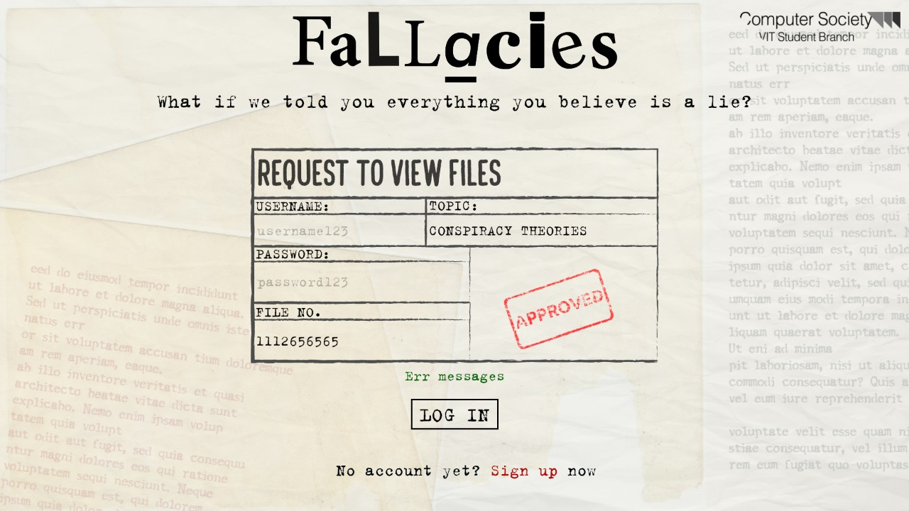
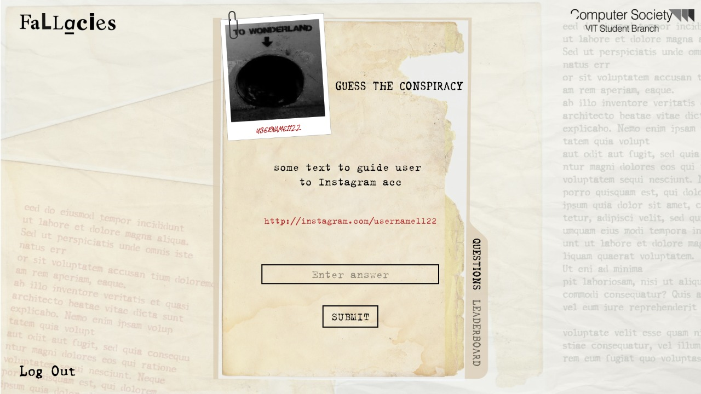

[![csivit][csivitu-shield]](https://github.com/csivitu)
[![Issues][issues-shield]](https://github.com/csivitu/Fallacies-Backend/issues)

<!-- PROJECT LOGO -->
<br />
<p align="center">
  <a href="https://github.com/csivitu/BroBot">
    
  </a>
  <br />
  <h3 align="center">Fallacies</h3>
  <p align="center">
    An online cryiptic hunt event based on conspiracy theories around the world
  </p>
</p>


<!-- TABLE OF CONTENTS -->
## Table of Contents

* [About the Project](#about-the-project)
  * [Built With](#built-with)
* [Getting Started](#getting-started)
  * [Prerequisites](#prerequisites)
  * [Installation](#installation)
* [Usage](#usage)
* [Roadmap](#roadmap)
* [Contributing](#contributing)
* [License](#license)
* [Contributors](#contributors-)


<!-- ABOUT THE PROJECT -->
## About The Project


Fallacies was an event where players scavenge for clues through mysterious instagram profiles and reach on a final answer. The players analyse the posts and stories on the account and enters the final answer on the platform made for the same. This project is the backend for the same platform. We make the user login or signup and the user is then redirected to the answer submissions page where they have to input answer. The server returns the next account if the answer entered by the user is correct otherwise an appropriate error message is returned. 


### Built With

* [Node js](https://nodejs.org/en/)
* Using [Express](https://expressjs.com/)
* and [Mongoose](https://mongoosejs.com/)


<!-- GETTING STARTED -->
## Getting Started

To get a local copy up and running follow these simple steps.

### Prerequisites

This is an example of how to list things you need to use the software and how to install them.
* npm
```sh
npm install npm@latest -g
```

### Installation
 
1. Clone the repo
```sh
git clone https://github.com/csivitu/Fallacies-Backend.git
```
2. Install NPM packages
```sh
npm install
```


<!-- USAGE EXAMPLES -->
## Usage

<p align="center">
  
  <br />
  
</p>


<!-- ROADMAP -->
## Roadmap

See the [open issues](https://github.com/csivitu/Fallacies-Backend/issues) for a list of proposed features (and known issues).


<!-- CONTRIBUTING -->
## Contributing

Contributions are what make the open source community such an amazing place to be learn, inspire, and create. Any contributions you make are **greatly appreciated**.

1. Fork the Project
2. Create your Feature Branch (`git checkout -b feature/AmazingFeature`)
3. Commit your Changes (`git commit -m 'feat: Add some AmazingFeature'`)
4. Push to the Branch (`git push origin feature/AmazingFeature`)
5. Open a Pull Request

You are requested to follow the contribution guidelines specified in [CONTRIBUTING.md](./CONTRIBUTING.md) while contributing to the project :smile:.

<!-- LICENSE -->
## License

Distributed under the MIT License. See [`LICENSE`](./LICENSE) for more information.


<!-- MARKDOWN LINKS & IMAGES -->
<!-- https://www.markdownguide.org/basic-syntax/#reference-style-links -->
[csivitu-shield]: https://img.shields.io/badge/csivitu-csivitu-blue
[csivitu-url]: https://csivit.com
[issues-shield]: https://img.shields.io/github/issues/othneildrew/Best-README-Template.svg?style=flat-square
[issues-url]: https://github.com/csivitu/repo/issues
